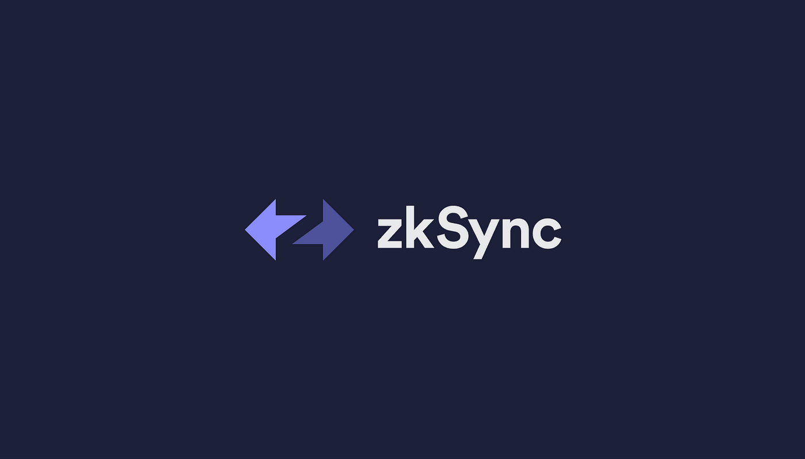

# zkSync Case Study

## Overview and Origin
Zksync is a layer 2 protocal that scales Ethereum's security and values through zero-knowledge cryptography powered by zkRollup technology, this project founded by Matter Labs intially strated at June in 2020 with this first product zkSync 1.0. From lastest series C round brings the total funding of 458 million. This includes a separate $200 million dedicated ecosystem fund, $50 million Series B led by a16z (crypto venture capital fund), and $8 million in Series A and Seed round. 

Over the past couple years, the biggest pain point with Ethereum transaction has been gas fee. Those gas fees are not variable, if you try to send $2 worth of Ethereum or $1millions, you will be pay the same amount in gas fee which depending on the demaned of the network, it will be quite discouraging for people who just gets their hands on crptos for small transaction. Many different team have been working on scaling Etheremum capbility with layer 2 soultion zkSync is one of them.

## Business Activities

* What specific financial problem is the company or project trying to solve?

* Who is the company's intended customer?  Is there any information about the market size of this set of customers?

* What solution does this company offer that their competitors do not or cannot offer? (What is the unfair advantage they utilise?)

* Which technologies are they currently using, and how are they implementing them? (This may take a little bit of sleuthing–– you may want to search the company’s engineering blog or use sites like StackShare to find this information.)

## Landscape

* What domain of the financial industry is the company in?

* What have been the major trends and innovations of this domain over the last 5–10 years?

* What are the other major companies in this domain?

## Results

* What has been the business impact of this company so far?

* What are some of the core metrics that companies in this domain use to measure success? How is your company performing, based on these metrics?

* How is your company performing relative to competitors in the same domain?

## Recommendations

* If you were to advise the company, what products or services would you suggest they offer? (This could be something that a competitor offers, or use your imagination!)

* Why do you think that offering this product or service would benefit the company?

* What technologies would this additional product or service utilise?

* Why are these technologies appropriate for your solution?
