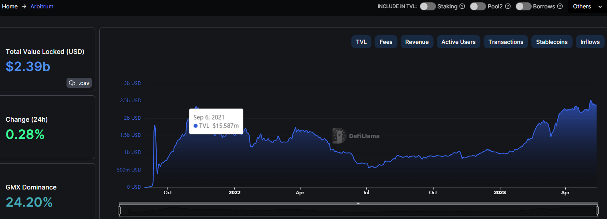

# **zkSync Case Study**

## **Overview and Origin**
Zksync is a layer 2 protocol that scales Ethereum's security and values through zero-knowledge cryptography powered by zkRollup technology, this project was founded by Matter Labs initially started June in 2020 with this first product zkSync 1.0. From latest series C round brings the total funding of 458 million. This includes a separate $200 million dedicated ecosystem fund, $50 million Series B led by a16z (crypto venture capital fund), and $8 million in Series A and Seed rounds. 

Over the past couple years, the biggest pain point with Ethereum transaction has been gas fee. Those gas fees are not variable, if you try to send $2 worth of Ethereum or $1 millions, you will be pay the same amount in gas fee which depending on the demand of the network, it will be quite discouraging for people who just get their hands on crypto for small transaction. Many different teams have been working on scaling Etheremum capability with layer 2 solution zkSync is one of them.

## **Business Activities**
Historical average gas fees

This is a picture showing the historical average gas fees from 2016 to the present, as the chart showed strat from early 2020 to mid-2022 the rising demand of the network such as the heat of decentralized finance，NFT，etc. push to the gas fees mantain within a very high level. zkSync is one of the projects that trying to distribute the pressure of Ethereum.

### **Company's intended customer**  
* **Ethereum users**

    as the chart shows the Ethereum unique addreses since 2016 until present, there are 231 millions users in the network, according to etherscan. It has a very healthy growth slope with an increasing number of daily addresses added. While not all of these addresses represent unique users, this number provides a sense of the potential user for zkSync
* **dApp developers**

The DeFi ecosystem on Ethereum has grown rapidly over the past years, in the picture shown the data for 2023 May with over $26.91 billions worth of assets locked in Defi protocols, according to DeFiLlama, This growth has created signficant demand for layer 2 scaling solutions like zkSync, which can help dApps handle the increased transaction volume and reduce gas fees
 
* **Businesses and enterprises**

     The potential market size for businesses and enterprises that could benefit from using zkSync is difficult to estimate, as it depends on the specific use cases and industries involved. However, there are a growing number of companies exploring blockchain technology for a variety of purposes, such as supply chain management, digital identity verification, and more.

### **Technology**
zkSync use **Zero Knowledge proofs(ZKPs)** which is a cryptographic technique that allows a prover to demonstrate to a verifier the truth of a statement without revealing any additional information. In zkSync, ZKPs are used to verify all transactions from the Ethereum main chain to the zkSync Layer 2, ensuring transaction security and reducing transaction costs.zkSync uses **Rollup technology**, which bundles multiple transactions into a batch, further improving transaction speed and throughput.

## **Landscape**
zkSync is a Ethereum layer 2 scaling solution, which is a blockchain platform used for decentralized applications and cryptocurrecy transactions, but zkSync is not a company, it is developed by Matter Labs, a research and development organization focused on building scalable and secure blockchain infrastructure.

Over the past 5-10 years the blockchain and cryptocurrency domain has experienced significant growth and innovation.Some of the major trends and innovations includes:
* Decentralized Finance(DeFi)- the rise of Defi applications and protocols that allow for decentralized lending, borrowing, trading, and investing without the need for bank
* Non-Fungible Tokens (NFTs)- the use of blockcahin technology to create unique ditial assets, such as art, music, game character, and collectibles. it can be bought and sold like physical assets
* Smart Contract- the ability to create self-executing contracts with specific conditions
and rules encoded on the blockchain, and those contracts are transparent, immutable, secure.
* Stablecoins- the development of cryptocurrencies that are equal to the value of fiat currencies which help provide better stability and usaability for cryptocurrency users
* Central Bank Digital Currencies(CBDCs)- the exploration and development of the digital version of fiat currencies

## **Results**
zkSync is a relatively new technology and still underdevelopment, it has not yet had a significant business on the market. As a scaling solution for Ethereum, zkSync aims to increase the transaction throughput and efficiency of the Ethereum Network, which could have a significant impact on the adoption and usability of Ethereum and other blockchanin-based applications

By achieving cheaper, faster, and more secure transactions, zkSync could potentially lead to increased usage of Dapps and greater adoption of cryptocurrencies. This will bring new opportunities for companies operating in the blockchain and cryptocurrency domain.

### **Metrics that evaluate project success**
* Transaction Volume
* User Adoption
* Market Capitalization

#### **zkSync transaction volume**

#### **competitor transaction volume (Arbitrum)**

#### **competitor unique addresses (Arbitrum)** 

#### **zkSync Maketcap**

#### **competitor marketcap (Arbitrum)**

Form the charts that illustrated the gap between Arbitrum(one of the biggest layer 2 networks). Compare to the amount of transactions and total assets locked in the network zkSync still seems to be very little. As well as zkSync is still under development and has not done IDO(intial decentralize offering), also the unique addresses have not been disclourse yet, but the growth of the project is fast, as the total assets locked has been increased 10 times from March 2023 to May 2023.

## **Recommendations**
Based on the current trends in the blockchain and cryptocurrency industry, I would suggest that zkSync explore the possibility of offering decentralized finance (DeFi) products and services. DeFi has been one of the most significant growth areas in the blockchain industry over the past year, with billions of dollars now being transacted through DeFi protocols.

Specifically, zkSync could consider offering more decentralized exchanges (DEX) built on their technology. DEXs are increasingly popular in the DeFi space due to their ability to provide users with control over their assets, improved security, and more transparent pricing.

By offering more DEXs, zkSync could benefit from the growing demand for DeFi products and services and potentially capture a share of the market. The use of zero-knowledge proofs could also provide additional benefits such as increased privacy and security.

